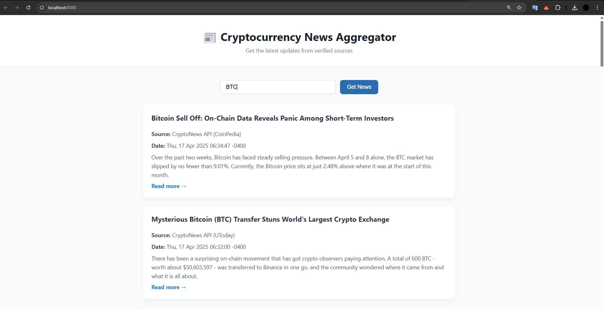

# 📰 Cryptocurrency News Aggregator

A clean and modern web app that aggregates cryptocurrency news from multiple sources (CryptoNews API & NewsData.io) based on the user's selected crypto symbol (e.g. BTC, ETH). Built with Rust backend (Actix-web) and HTML/CSS/JavaScript frontend.

---

## 📸 Screenshot


---

## 🚀 Features

- ✅ Aggregates news from **two sources**
- ✅ Displays **source**, **date**, and **summary**
- ✅ Stylish, professional **frontend UI**
- ✅ Fully responsive and easy to use
- ✅ Handles invalid input and API errors

---

## 📦 Tech Stack

- **Backend:** Rust + Actix Web + Reqwest + Tokio
- **Frontend:** HTML + CSS + Vanilla JS
- **APIs:**
  - [CryptoNews API](https://cryptonews-api.com/)
  - [NewsData.io](https://newsdata.io/)

---

## ⚙️ Installation

### 1. Clone the repo:
```bash
git clone https://github.com/your-username/crypto-news-aggregator.git
cd crypto-news-aggregator/backend
```

### 2. Setup `.env` file:
```
CRYPTO_API_KEY=your_cryptonews_api_key
NEWSDATA_API_KEY=your_newsdata_api_key
```

### 3. Run backend server:
```bash
cargo run
```

> Server will run at: [http://localhost:8080](http://localhost:8080)

---

## 📂 Project Structure

```
├── backend
│   ├── src
│   │   ├── main.rs
│   │   ├── api.rs
│   │   ├── handlers.rs
│   │   └── models.rs
│   └── .env
│
├── frontend
│   ├── index.html
│   ├── style.css
│   └── script.js
```

---

## 📃 License
MIT License. Use freely, star if helpful ⭐
